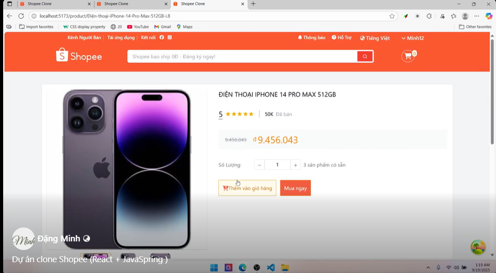
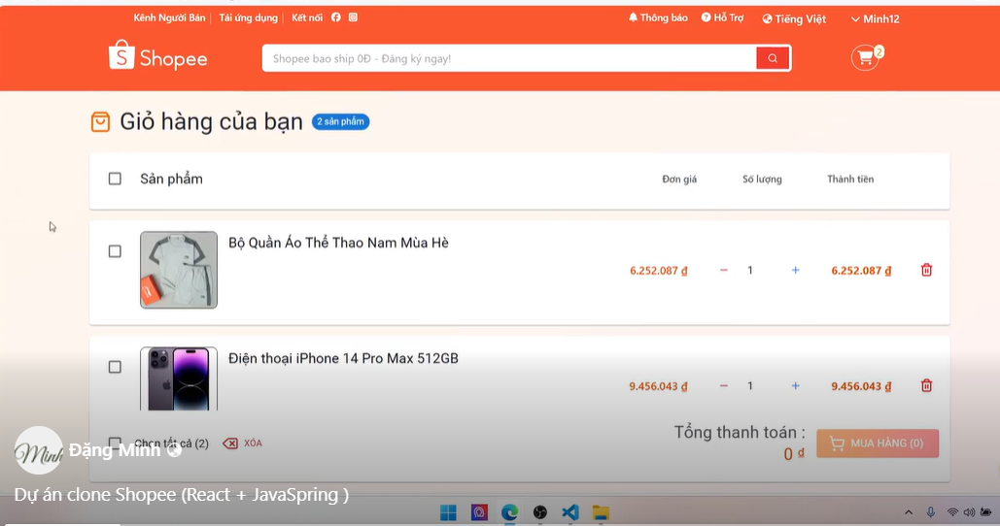
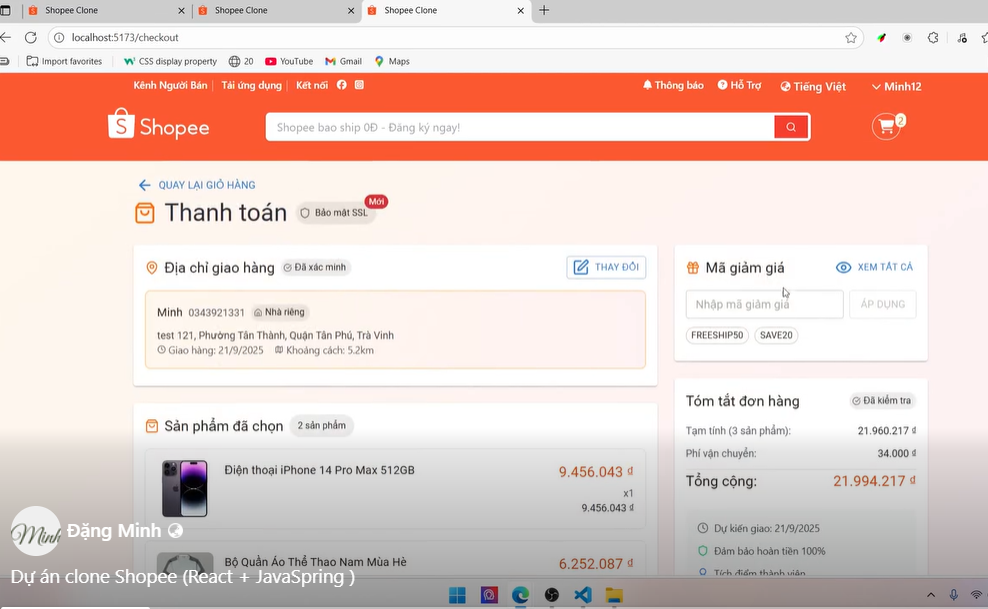
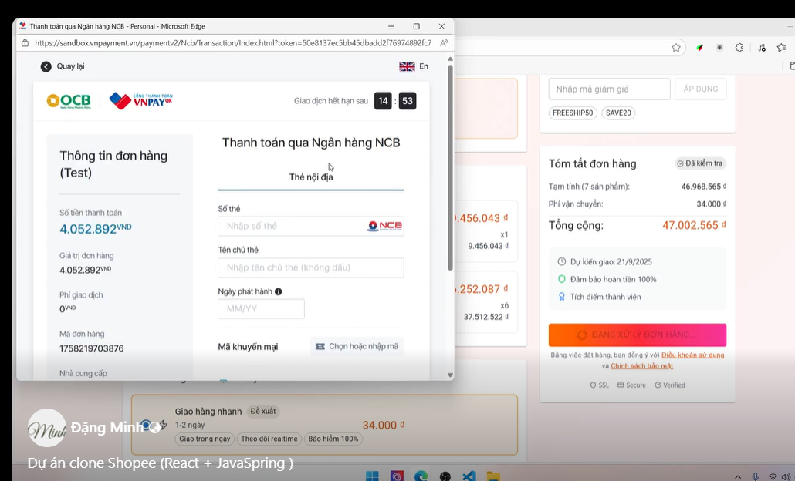
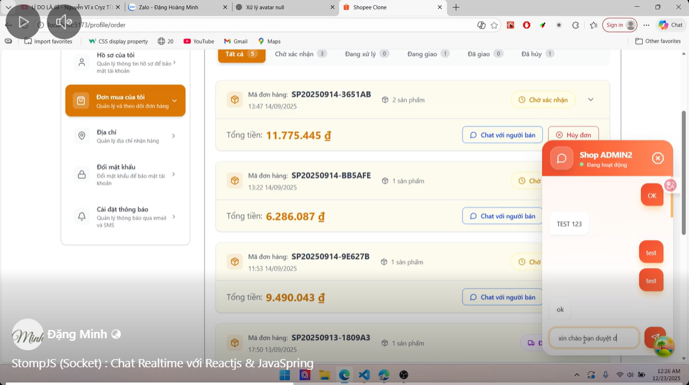

# 🛒 Fullstack Shopee Clone

A **fullstack e-commerce platform inspired by Shopee**, built with **Spring Boot + React + MySQL**, featuring **realtime chat**, **VNPAY payment integration**, and **admin dashboard**.

This project is designed as a **portfolio-grade system**, focusing on **clean architecture, realtime communication, and real-world business flows**.

---

## 🚀 Features

### 👤 User

- Register / Login (JWT Authentication)
- Browse products & categories
- Search & filter products
- Add to cart & checkout
- Online payment via **VNPAY**
- Realtime chat with shop

### 🏪 Shop

- Shop profile management
- Product CRUD
- Order management
- Realtime chat with users

### 🛠️ Admin

- Dashboard & statistics
- Manage users, shops, products
- Realtime customer support chat

---

🧱 Tech Stack
Frontend

React + TypeScript

Redux Toolkit & RTK Query

WebSocket (STOMP + SockJS)

Tailwind CSS

Backend

Spring Boot

Spring Security + JWT

Spring WebSocket

Spring Data JPA (Hibernate)

Database

MySQL

Payment

VNPAY Gateway

💬 Realtime Chat Highlights

Private messaging (/user/queue/messages)

Optimistic UI (sender sees message instantly)

Receiver gets message via WebSocket

Sidebar auto-updates last message

Supports User ↔ Shop ↔ Admin

💳 VNPAY Payment Flow

User places order

Backend generates VNPAY payment URL

User completes payment on VNPAY

VNPAY callback verified with secure hash

Order status updated

## 🎥 Demo (Screenshots / Video)

## 🎥 Demo

🔗 **Demo video**:  
https://www.facebook.com/share/v/1MpxoW8FcD

---

### 🏠 Homepage

---

### 🛍️ Product Page

---

### 🛒 Cart Page

---

### 💳 Checkout Page

---

### 💰 VNPAY Payment

---

### 📦 Order Page + Chat

